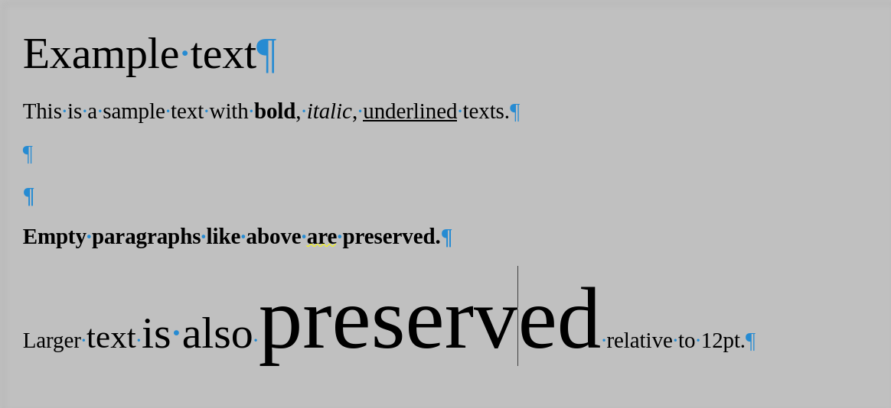

# odt2cleanhtml

Convert LibreOffice `.odt` files to clean, minimal HTML while preserving paragraph order and essential formatting.


## What it does

- Extracts text from `.odt` files using LibreOffice's headless converter
- Strips all unnecessary HTML tags and styling cruft
- Preserves **bold**, *italic*, underline, and superscript
- Converts non-standard font sizes to relative `<span style="font-size:Xem">` tags
- Handles headings, blockquotes, lists, and nested structures
- Fixes common LibreOffice HTML export bugs (split quotation marks, empty paragraphs)


## Example

<table>
<tr>
<td>
  
Input
  
(LibreOffice ODT)

</td>
<td width="30%">


 
</td>
</tr>
<tr>
<td>

Output
  
(Clean HTML)

</td>
<td>

```html
<span style="font-size:2.0em">Example text</span>

This is a sample text with <b>bold</b>, <i>italic</i>, <u>underlined</u> texts.


<strong>Empty paragraphs like above are preserved.</strong>

Larger <span style="font-size:1.5em">text</span><span style="font-size:2.0em">is also</span>[...]
```

</td>
</tr>
</table>


## Difference from built in HTML exporter

Generally it works by cleaning up the output of the internal exporter.

The output is not meant to be a HTML file but can instead be thought of as a "markdown-like" containing HTML tags.

- Removed tags: \<head>, \<meta>, \<style>, \<font> tags, lang attributes, inline margin/text-indent styles, class attributes, redundant whitespace, ...

- Preserved Tags: All text content, paragraph breaks, bold/italic/underline formatting, font-size information (converted to relative em units)
